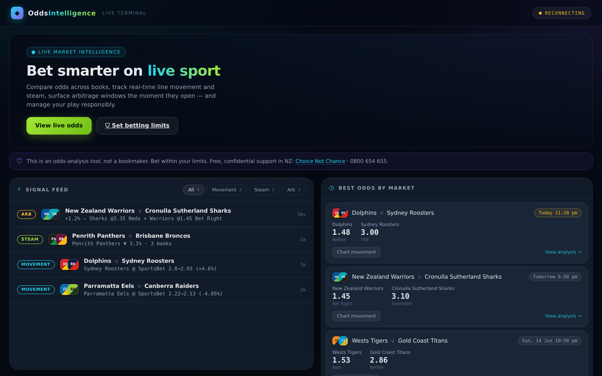

# NRL Odds Intelligence Pipeline

A real-time, event-driven pipeline that ingests live sports-betting odds across
multiple bookmakers, detects **line movement**, **steam moves**, and
**arbitrage windows** by diffing successive snapshots, and streams the signals
to a live dashboard over WebSocket.



> Built as a portfolio project to demonstrate streaming data engineering,
> real-time detection, and full-stack delivery. It is an **odds-analysis tool,
> not a bookmaker** — all analysis is derived from market data, with responsible
> gambling guidance built into the UI.

## What it does

- **Polls** The Odds API on a match-window-aware schedule (slows down when
  nothing is on, speeds up near kickoff) to respect the free-tier quota.
- **Streams** every odds snapshot into Redis Streams, consumed by a separate
  processor via a consumer group (at-least-once delivery, survives restarts).
- **Detects** three signal types by diffing snapshots:
  - *Line movement* — a notable price shift on one book/outcome
  - *Steam* — several books shortening the same outcome together (sharp money)
  - *Arbitrage* — best cross-book prices implying < 100%, with stake split
- **Pushes** detected signals to the browser in real time over WebSocket.
- **Analyses** each match on a dedicated page: vig-removed implied probability,
  bookmaker margin, book-by-book price comparison, line-movement chart, a
  derived expected-margin model, value flags, and live scores.

## Architecture

```
The Odds API
     │
     ▼
Poller (APScheduler, adaptive cadence)        ── ingestion
     │  raw odds snapshots
     ▼
Redis Streams ──── raw_odds
     │
     ▼
Processor (consumer group)                    ── detection
     ├── diff engine        (per-book, per-outcome deltas)
     ├── movement / steam   (shift + multi-book consensus)
     └── arbitrage scanner  (cross-book +EV, stake allocation)
     │
     ▼
Redis (event store + pub/sub)
     │
     ▼
FastAPI + WebSocket                           ── delivery
     │
     ▼
React dashboard + match analysis pages        ── UI
```

Five containerised services orchestrated with Docker Compose: `redis`,
`poller`, `processor`, `api`, `frontend`.

## Tech stack

| Layer        | Tech |
| ------------ | ---- |
| Ingestion    | Python, APScheduler, httpx |
| Broker/store | Redis Streams, pub/sub |
| Processing   | Python (consumer groups, pure diff/detection logic) |
| API          | FastAPI, WebSockets, uvicorn |
| Frontend     | React, Vite, react-router, Recharts |
| Infra        | Docker, Docker Compose, nginx |

## Coverage

Odds come from **The Odds API**. The pipeline tracks the markets the API
actually exposes with real multi-bookmaker prices: **NRL**, **NRL State of
Origin**, **Six Nations**, **EPL**, and **Champions League** (head-to-head).

> Club logos are trademarked, so the UI generates **team crests** from real club
> colours + monograms instead — deterministic, no copyright risk. Additional
> markets (totals, handicap, player props) require a paid API tier and are out
> of scope for the free build.

## Run it locally

```bash
git clone https://github.com/coryypeters/nrl-odds-intelligence-pipeline.git
cd nrl-odds-intelligence-pipeline
cp .env.example .env          # add your free Odds API key
docker compose up --build
```

| Surface        | URL |
| -------------- | --- |
| Dashboard      | http://localhost:5173 |
| API — events   | http://localhost:8000/api/events |
| API — odds     | http://localhost:8000/api/odds |
| API — match    | http://localhost:8000/api/match/{event_id} |
| API — health   | http://localhost:8000/api/health |

Verify snapshots are flowing:

```bash
docker compose exec redis redis-cli XRANGE raw_odds - + COUNT 5
```

## Deployment

See [DEPLOY.md](DEPLOY.md) for deploying the five services to Railway with a
managed Redis.

## Design notes

- **Quota-aware polling.** The poller learns each sport's match windows from
  event kickoff times and adapts cadence (10 min idle -> 1 min pre-match ->
  30 s in-play), with a hard backoff if the API quota is exhausted.
- **Exchange prices handled correctly.** Betfair lay markets are kept distinct
  from back markets so they can't fake an arbitrage.
- **Honest analytics.** The "expected margin" and recommendations are derived
  from market probabilities and labelled as such — never presented as form
  predictions the data can't support.

## Responsible gambling

This project is for analysis and demonstration only. It surfaces market
information; it does not encourage betting. The UI links to NZ support services
and includes limit-setting prompts. 18+.
